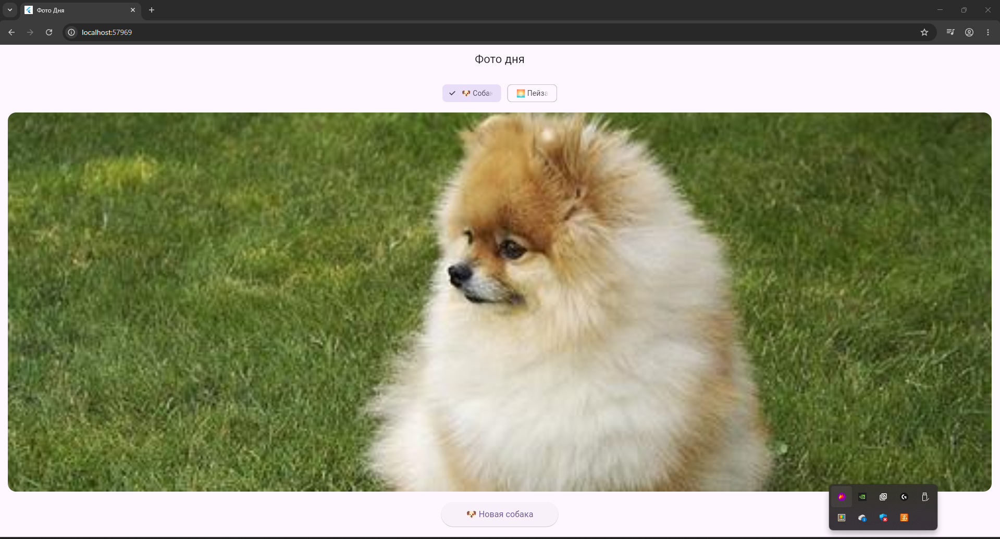

# Фото дня

Приложение на Flutter, которое загружает случайные фотографии собак из Dog API или пейзажи из Lorem Picsum. Демонстрирует работу с асинхронными запросами, Future, async/await и обработкой ошибок.

## Информация об авторе

**Имя:** Березкин Роман, Зубрева Эля

**Группа:** ИСП-233

## Стек и версии

- Flutter: 3.0+
- Dart: 3.12+
- Платформа: Web (Google Chrome)
- Пакеты: http ^1.6.0

## Скриншот приложения

## Как запустить

Запуск:
1. git clone <url>
2. cd photo_of_the_day
3. flutter pub get
4. flutter run -d chrome

## Что изучили

1. Future<T> — объект-обещание, который возвращает значение в будущем
2. async/await — синтаксис для работы с асинхронным кодом, делающий его похожим на синхронный
3. Обработка ошибок в асинхронном коде через try/catch
4. HTTP-запросы с использованием пакета http
5. Управление состояниями в Flutter с помощью setState()

## Ответы на вопросы

1. Что такое Future<T>? Чем отличается от обычного возвращаемого значения?

Future<T> — это объект, который представляет собой результат асинхронной операции, который будет доступен в будущем. Отличие от обычного возвращаемого значения: обычная функция возвращает результат сразу (синхронно), а Future возвращает результат не сразу, а когда операция завершится (например, после загрузки данных из интернета). Future можно ждать с помощью await или обрабатывать через .then().

2. Что делает await? Блокирует ли он весь поток выполнения?

await приостанавливает выполнение асинхронной функции до тех пор, пока Future не завершится, и не блокирует весь поток выполнения. Во время ожидания Flutter продолжает обрабатывать другие события (например, обновлять интерфейс, обрабатывать нажатия пользователя). Это ключевое отличие от синхронного ожидания, которое заморозило бы приложение.

3. Зачем setState() вызывается дважды в _fetchPhoto()?

Первый вызов setState() — в начале метода. Он нужен, чтобы установить _isLoading = true (показать индикатор загрузки) и очистить предыдущие _imageUrl и _errorMessage. Второй вызов setState() — в конце метода (в блоке finally или после try/catch). Он нужен, чтобы установить _isLoading = false (скрыть индикатор загрузки) и обновить UI с загруженным фото или сообщением об ошибке. Это позволяет показывать пользователю индикатор загрузки на время выполнения асинхронной операции.

4. Почему кнопке передаётся _fetchPhoto без скобок, а не _fetchPhoto()?

_fetchPhoto без скобок — это ссылка на функцию. Кнопка сама вызовет эту функцию в нужный момент (при нажатии). _fetchPhoto() со скобками — это вызов функции прямо сейчас, во время построения виджета. Тогда функция загрузила бы фото сразу при открытии экрана, а не по нажатию. В Flutter обработчики событий всегда передаются как ссылки на функции.

5. Чем Image.network() отличается от Image.asset()?

Image.network() загружает изображение по URL из интернета. Для его работы нужно разрешение INTERNET в AndroidManifest.xml. Скорость загрузки зависит от скорости интернета. Image.asset() загружает изображение из локальных файлов проекта. Для его работы нужно объявить папку с изображениями в pubspec.yaml. Загрузка происходит мгновенно. Image.network() используется для динамических картинок с сервера, а Image.asset() — для статичных картинок (иконки, фоны, логотипы).